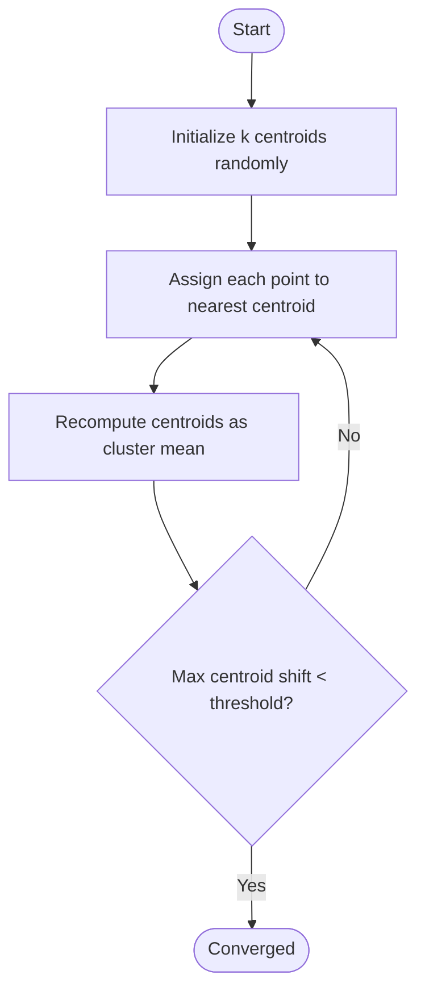

# The k-means algorithm

k-means partitions `n` data points into `k` clusters so that each point
belongs to the cluster with the nearest centroid (mean).

## Iteration



## Math

For each point `p`, compute `argmin_i ||p - c_i||` over all centroids
`c_i`. After assigning every point, recompute each centroid as the mean
of its assigned points:

```
c_i = (1 / |S_i|) * sum_{p in S_i} p
```

The algorithm is guaranteed to converge (each step is non-increasing in
total within-cluster variance), but only to a *local* minimum — the
result depends on initial placement. Run with `Loop ON` to watch
different random starts converge to different local minima on the same
data.

## Empty cluster handling

If a cluster ends up empty after the assignment step, the mean is
undefined (`0 / 0`). This project re-seeds the empty centroid to a
randomly chosen existing point. This keeps `k` stable and prevents
NaN centroids. The choice is consistent across "Reset centroids",
"Regenerate points", and the loop re-seed in `restart_for_loop`.

Implementation: `recompute_centroids_2d` / `_3d` in
`src/kmeans/algorithm.rs`.

## Convergence

A run converges when the largest centroid displacement during a
recompute step falls below `CONVERGENCE_THRESHOLD` (default `0.05`).
On convergence:

- The `converged` flag is set.
- Auto-run is cleared if Loop is OFF (so the "Pause" button label
  flips back to "Auto run").
- Auto-run is preserved if Loop is ON (so the loop machinery can
  restart with new centroids).

## Distance metric

Euclidean distance is the only built-in metric. A `Distance` trait
exists so other metrics (Manhattan, cosine) can slot in later, but the
algorithm core hard-codes Euclidean for simplicity.

For nearest-centroid comparisons, we use squared distance and avoid
the `sqrt` — it's monotonic in distance and saves cycles in the
inner loop.

## Pseudocode

```
init centroids = random_k_in_bounds()
loop:
    assignments = [argmin_i dist(p, c_i) for p in points]
    new_centroids = [mean(points where assignment == i) for i in 0..k]
    if max_shift(centroids, new_centroids) <= threshold:
        return
    centroids = new_centroids
```

## 2D vs 3D

The algorithm is implemented twice: `step_2d`, `step_3d`. They share the
same shape but with different point types and bounding boxes. This is
intentional — generic Rust code over a `Point` trait would be readable
but adds friction for new contributors. The two implementations are
short enough that duplication is the cheaper choice.

If you ever need an N-dimensional version, factor out the shared parts
then; don't pre-emptively generic-ify.
