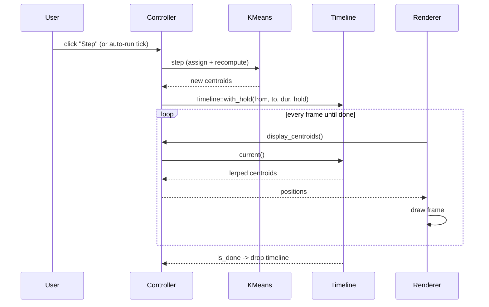

# Animation

The k-means algorithm produces *discrete* iterations: centroids jump from
old to new positions in one step. To make this watchable, the controller
records the "from" and "to" positions and interpolates between them over
~500 ms (or ~100 ms in "Run to convergence" mode).

## Per-step flow



## Timeline phases

Each `Timeline` has two phases:

```
0 ───── duration ───── duration + hold
 ╰──── tween ────╯╰─── hold (static) ──╯
```

- **Tween phase** (`0 <= elapsed < duration`): interpolates from→to with
  `smoothstep(t)` easing.
- **Hold phase** (`duration <= elapsed < duration + hold`): output stays
  at `to`. Used by Loop mode to give the user a moment to see the
  converged state before re-seeding.

`is_done()` returns true only after the hold phase. Set `hold = 0.0` for
the simple "tween then stop" behaviour.

## Loop mode

When Loop is ON and the algorithm converges:

1. The final timeline gets a `hold = hold_seconds` (slider in the panel).
2. When `is_done()` finally fires, `tick()` calls `restart_for_loop()`.
3. `restart_for_loop()` re-seeds centroids (same points, new random
   centroids), refreshes assignments, and clears `converged`.
4. The auto-run timer in `main.rs` fires the next step after
   `auto_run_interval` seconds.

Turning Loop ON automatically enables auto-run (the loop is meaningless
without something firing steps). Turning Loop OFF leaves auto-run alone.

## Easing

Linear lerp looks robotic, so positions are passed through `smoothstep`
(`t * t * (3 - 2*t)`) for ease-in/ease-out.

## Why points don't tween smoothly

Cluster assignment is also discrete: a point either belongs to cluster
A or cluster B. The current implementation snaps point colors when the
assignment changes. A future improvement could fade colors over a
fraction of the timeline.

## Why Voronoi edges/planes appear to glide

Voronoi topology changes discretely when centroids cross certain
thresholds — edges can appear, disappear, or split as cells reorganise.
Interpolating the *topology* is a research problem. We sidestep it by
rebuilding the diagram from the *animated* centroid positions every
frame. The edges still snap when topology changes, but they glide
smoothly between snaps because the centroids underneath are gliding.

## Run-to-convergence mode

Same machinery, but with `FAST_ANIMATION_DURATION = 0.1s` per step and
no auto-run timer — each step is fired directly when the previous one's
timeline finishes. This finishes a full convergence run in a couple of
seconds while still being watchable.
