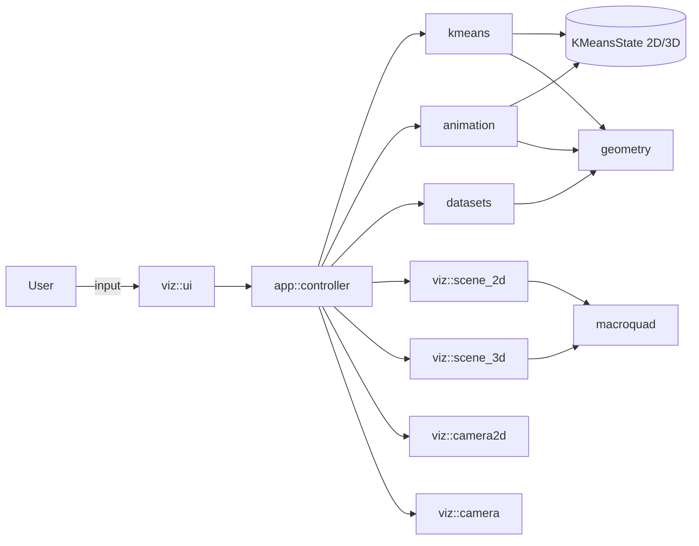

# Architecture

The project is split into two halves:

- **Pure logic** (the `kmeans_viz` library crate): `geometry`, `kmeans`,
  `animation`, `datasets`. No macroquad imports. Fully unit-tested.
- **Rendering & glue** (the `kmeans-viz` binary): `viz`, `app`, `main.rs`.
  Depends on macroquad. Not unit-tested — exercised by running the app.

The boundary is enforced by which modules import `macroquad::*`. Don't
break it without a good reason.

## High-level dataflow

## Layers

### Pure-logic layer

`geometry` — `Point2`, `Point3`, distance / arithmetic ops, Voronoi edge
computation, 3D bisector planes, normal-distribution sampling, blob /
moon generators.

`kmeans` — algorithm state, step / assign / centroid recomputation,
convergence detection. 2D and 3D variants kept explicit instead of
generic to keep types readable.

`animation` — linear and smoothstep tweens, `Timeline` types with a
tween phase and an optional hold phase (used by Loop mode).

`datasets` — embedded Fisher iris CSV, CSV parser, PCA implementation
for 3D iris projection.

### Rendering layer

`viz::scene_2d`, `viz::scene_3d` — pure drawing functions that take
world-space inputs and use macroquad to render.

`viz::camera`, `viz::camera2d` — orbit camera for 3D, pan+zoom camera
for 2D. Both own their mouse state.

`viz::ui` — immediate-mode panel with two tabs and a collapse button.
Data-in / data-out: `draw_panel(PanelInputs) -> UiState`. The host
applies the deltas itself.

`app::controller` — owns all controller state, mediates between the
algorithm, the animation timeline, and the renderer. Holds the
`initial_centroids_2d/3d` snapshots used by "Clear to initial".

`main.rs` — event loop. Reads UI state, fires controller methods, runs
the camera input handlers, decides what a 2D left-click does based on
the current `EditMode`. Also contains the wasm `getrandom` shim.

## Why this split

- Logic stays portable, testable, and wasm-friendly without dragging the
  renderer along.
- The renderer can be replaced (e.g. swap macroquad for Bevy) without
  touching the algorithm.
- CI runs `cargo test` on the library; the binary is type-checked but not
  executed in tests.
