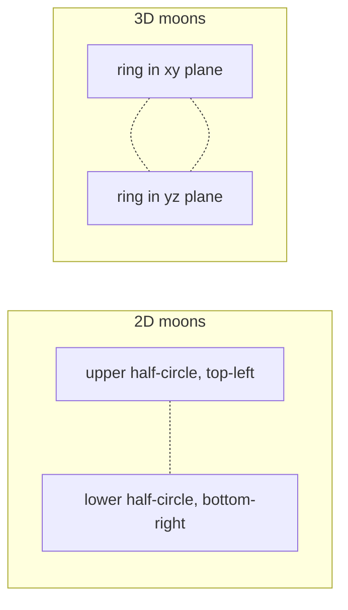
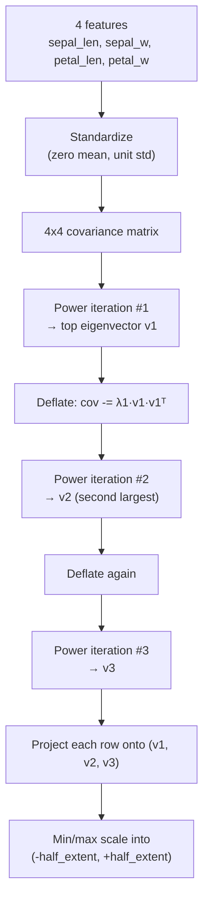

# Datasets

Three datasets ship with the visualizer. All work in both 2D and 3D
mode. Datasets are embedded as `&str` constants (via `include_str!`)
so they work identically on desktop and wasm — no filesystem access.

| Dataset | 2D | 3D |
|---|---|---|
| `Blobs` | Gaussian blobs at random centers | Same, in a 3D cube |
| `Moons` | Classic two-moons (interleaving half-circles) | Two interlocking rings |
| `Iris` | Fisher iris, projected to (sepal-len, petal-len) | Fisher iris, projected via PCA |

## Blobs

`generate_blobs_2d` / `generate_blobs_3d`. Picks `num_blobs` random
centers inside a margin of the world bounds, then samples points from
isotropic Gaussians around each center. Standard deviation is tuned so
clusters are visually distinct but slightly overlapping — good for
showing k-means succeeding cleanly.

## Two moons

`generate_moons_2d`: parametric half-circles for `t in [0, π]`:

```
upper: (cos t - 0.5,  sin t - 0.25)
lower: (-cos t + 0.5, -sin t + 0.25)
```

Plus Gaussian noise. k-means famously misclusters this — the moons are
not linearly separable, but k-means draws a straight bisector. Useful
for showing what k-means cannot do.

`generate_moons_3d`: two interlocking rings. One ring lies in the
xy-plane offset by `-radius/2` in x; the other lies in the yz-plane
offset by `+radius/2` in x. They thread through each other like chain
links. Same lesson as the 2D version.



## Iris

The Fisher iris dataset (150 samples, 4 features: sepal length, sepal
width, petal length, petal width). Embedded verbatim in
`src/datasets/iris.rs` as a CSV string.

### 2D projection

`iris_2d` uses two raw features:

- **x**: sepal length, mapped from `[4.3, 7.9]` to `[50, 950]`
- **y**: petal length, mapped from `[1.0, 6.9]` to `[50, 650]`

This gives the clearest visual separation of the three species
(setosa, versicolor, virginica) without needing dimensionality
reduction.

### 3D projection (PCA)

`iris_3d` uses all 4 features and runs PCA to find the 3 most
informative axes:



Why power iteration with deflation?

- 4×4 symmetric matrix — power iteration converges in ~10-30 iterations
- We only need the **top 3** eigenvectors, not all 4
- No external linear-algebra dependency
- Trivial to test (diagonal-matrix tests in `datasets/mod.rs`)

Iris's first 2 principal components capture ~96% of variance, so the
3rd axis is visually thinner than the first two. That's mathematically
correct, not a bug.

## Adding a new dataset

1. Add the data file in `src/datasets/` — embed as `pub const CSV: &str`
   in a new submodule (mirror `iris.rs`).
2. Add a `your_dataset_2d() -> Dataset2D` and `_3d(half: f32) -> Dataset3D`
   in `datasets/mod.rs`. Reuse `parse_csv_features` for CSV input.
3. Add a `DatasetChoice` variant in `src/viz/ui.rs`.
4. Dispatch it in `controller::regenerate_2d_for_current_dataset` and
   `_3d_for_current_dataset`.
5. Add tests confirming the points stay within the expected bounds.
