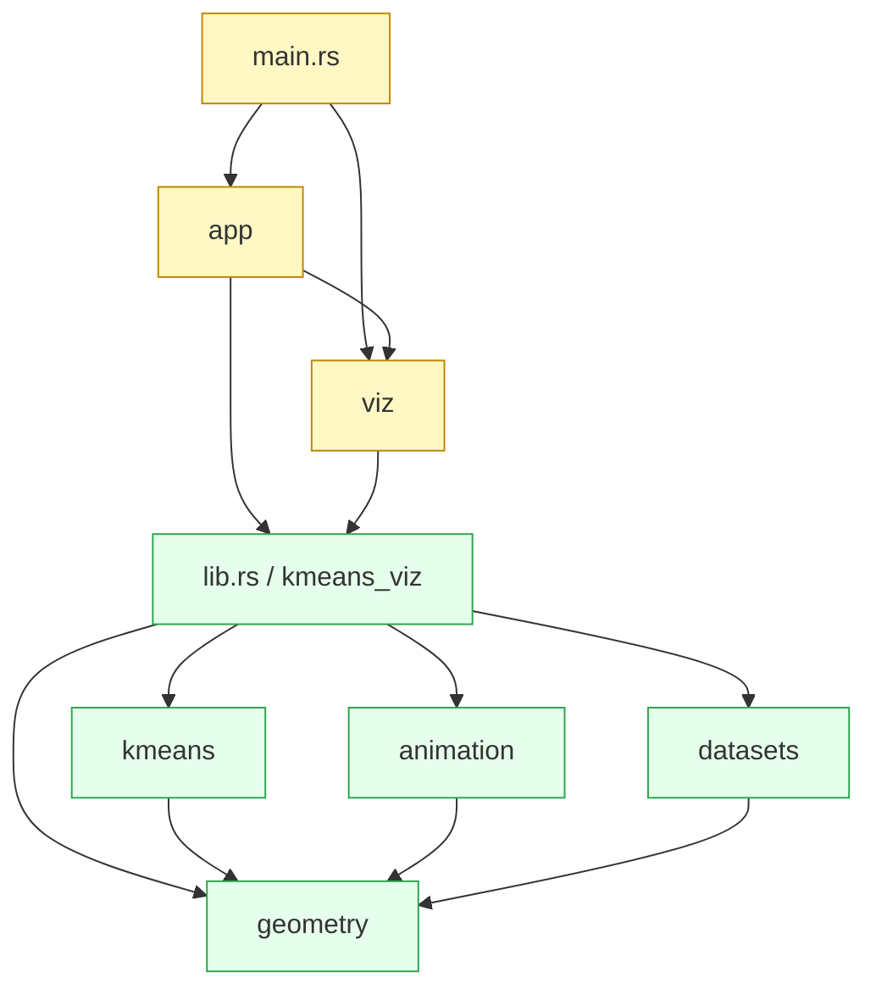

# Module graph

**Green** = pure logic, no macroquad, fully tested.
**Yellow** = rendering / glue, depends on macroquad.

The arrows only flow from yellow to green, never the other way. This
guarantees the pure crate stays portable.

## Submodule contents

`geometry`:
- `point` — `Point2`, `Point3` with arithmetic and distance
- `voronoi` — edge computation, special-case for `k=2`
- `planes` — 3D Voronoi bisector quads
- `sampling` — Box-Muller normal sampling, blob and moon generators

`kmeans`:
- `state` — `KMeansState2D`, `KMeansState3D`
- `distance` — `Distance` trait, Euclidean impl
- `centroid` — random init, mean computation, re-seed on empty cluster
- `algorithm` — `step_2d`, `step_3d`, convergence check

`animation`:
- `tween` — `lerp_f32`, `lerp_point2/3`, `smoothstep`
- `timeline` — `Timeline2D`, `Timeline3D` with tween + hold phases

`datasets`:
- `iris` — embedded Fisher iris CSV
- `mod` — CSV parsing, `iris_2d`, `iris_3d` (with PCA)

`viz`:
- `camera` — 3D orbit camera
- `camera2d` — 2D pan+zoom camera
- `scene_2d` — point / centroid / Voronoi-edge drawing
- `scene_3d` — sphere / plane / grid drawing
- `ui` — control panel (tabs, sliders, buttons)

`app`:
- `controller` — orchestrates state + animation + dataset switching
