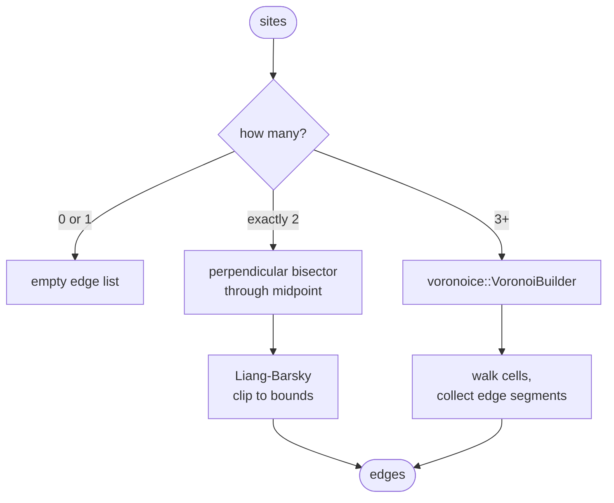

# Voronoi visualization

The visualizer can overlay Voronoi cell boundaries to show where each
centroid's "territory" begins and ends. The implementation is different
in 2D and 3D.

## 2D edges

`compute_edges(sites, bounds)` returns a list of line segments to draw.
The implementation has two paths:

- **`k >= 3`**: delegated to the `voronoice` crate (which uses delaunator
  under the hood). Builds the Voronoi diagram, clips it to the
  bounding box, and yields the edges of every cell.

- **`k == 2`**: special-cased. voronoice / delaunator cannot triangulate
  with only two collinear sites. We compute the perpendicular bisector
  manually and clip it to the bounds with Liang-Barsky line clipping.



The k=2 path also handles coincident sites: when both points are at the
same location the bisector is undefined and we return an empty edge
list, not a panic.

## 3D bisector planes

True 3D Voronoi *cells* are convex polyhedra. Computing them is
non-trivial (and would need a 3D Delaunay triangulation library).
Instead, for visualization, we draw a single bisector plane between
every pair of centroids:


This isn't the strict Voronoi tessellation (we don't trim each plane
against the others), but visually it gives a strong sense of the
partition. For `k=2` the plane is exact; for `k>=3` planes overlap and
clutter visually — that's why the Voronoi overlay defaults to OFF in 3D.

Pseudocode (in `src/geometry/planes.rs`):

```
for each pair (i, j) with i < j:
    mid     = (centroids[i] + centroids[j]) / 2
    n       = normalize(centroids[j] - centroids[i])
    helper  = pick a basis vector not parallel to n
    u       = normalize(n × helper)
    v       = normalize(n × u)
    radius  = world_half_extent * 3  // big enough to span the cube
    quad    = [mid ± radius·u ± radius·v]
    quad    = clamp each corner into the cube
    emit PlaneQuad { corners: quad, pair: (i, j) }
```

The clipping is a hack — we clamp each corner independently to the cube
rather than performing proper Sutherland-Hodgman polygon clipping. The
result is visually correct for the typical centroid arrangements you see
in k-means, and the code stays simple.

## Rendering details

- 2D edges: thin gray lines at 1.5px, semi-transparent.
- 3D planes: tinted with the midpoint of the two cluster colors at 18%
  alpha, with brighter edges at 70% alpha. Fill is faked with parallel
  line strips (macroquad has no `draw_triangle_3d`).
- For k≥5 in 3D, the plane count is C(k, 2) = k·(k-1)/2 which gets
  busy fast — the toggle exists for a reason.
