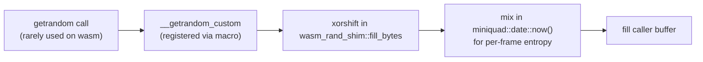
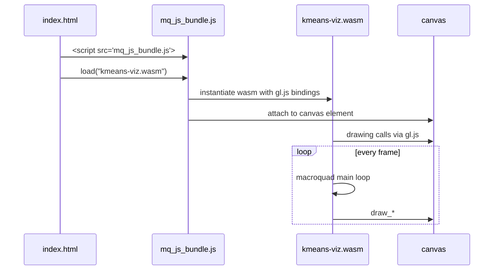

# WebAssembly build

The same Rust binary runs in the browser via `wasm32-unknown-unknown`.
This doc covers the non-obvious parts of getting that to work.

## Build steps

```bash
rustup target add wasm32-unknown-unknown
cargo build --release --target wasm32-unknown-unknown

mkdir -p dist
cp target/wasm32-unknown-unknown/release/kmeans-viz.wasm dist/
cp web/index.html dist/
curl -fL -o dist/mq_js_bundle.js \
  https://raw.githubusercontent.com/not-fl3/macroquad/master/js/mq_js_bundle.js

basic-http-server dist/
```

`.github/workflows/wasm.yml` does the same on CI and deploys to GitHub
Pages.

## The gl.js version-mismatch trap

If you load the page and see:

```
Version mismatch: gl.js version is: 2, miniquad crate version is: 262144
```

…you've linked the wrong `mq_js_bundle.js`. The hosted copy at
`https://not-fl3.github.io/miniquad-samples/mq_js_bundle.js` is stale
relative to current `miniquad` 0.4.x crates. The fix is to vendor the
matching bundle from the macroquad repo:

```
https://raw.githubusercontent.com/not-fl3/macroquad/master/js/mq_js_bundle.js
```

If you upgrade `macroquad` in `Cargo.toml`, re-download `mq_js_bundle.js`
from the matching tag (e.g. `.../macroquad/v0.4.14/js/mq_js_bundle.js`)
so the gl.js loader and the miniquad crate stay in sync.

## The getrandom compile-error trap

`rand 0.8` pulls in `getrandom 0.2`. On `wasm32-unknown-unknown` without
a backend feature, `getrandom` refuses to compile with:

```
the wasm*-unknown-unknown targets are not supported by default,
you may need to enable the "js" feature
```

The naive fix is to enable `features = ["js"]`. **Don't.** That pulls in
`wasm-bindgen`, which breaks macroquad's simple loader with:

```
TypeError: import object field '__wbindgen_placeholder__' is not an Object
```

The right fix is `getrandom`'s `custom` feature plus a tiny shim. From
`Cargo.toml`:

```toml
[target.'cfg(target_arch = "wasm32")'.dependencies]
getrandom = { version = "0.2", features = ["custom"] }
```

The shim lives at the top of `src/main.rs` and registers a xorshift PRNG
seeded from `miniquad::date::now()`:



We never actually call `getrandom` on the hot path — `StdRng::seed_from_u64`
covers all the algorithm randomness — but the shim satisfies the linker.

## Loader architecture

The mq_js_bundle.js loader works like this:



[118;1:3uThree things must line up:

1. `index.html` references `mq_js_bundle.js` (relative path, same origin).
2. `mq_js_bundle.js` is the version matching the miniquad in `Cargo.lock`.
3. `kmeans-viz.wasm` exports the symbols `mq_js_bundle.js` expects (it
   does, since macroquad's `#[macroquad::main]` macro emits them).

## Rust toolchain version

Native build works with Rust 1.75+. The wasm build needs **Rust 1.77+**
because `wasm-bindgen-shared` (transitively pulled by some dependency
versions) requires it. If you hit:

```
package `wasm-bindgen-shared v0.2.121` cannot be built because it
requires rustc 1.77 or newer
```

…run `rustup update` and try again. If you must stick with an older
toolchain, you can `cargo update -p wasm-bindgen-shared --precise <older-version>`
to pin a compatible release.

## What does NOT work in wasm

- File system access (no `std::fs`). All datasets are embedded with
  `include_str!`.
- `thread_rng()` and other `OsRng` calls (we use seeded `StdRng` only).
- Native threading (`std::thread::spawn`). Macroquad enforces this with
  panics on misuse.
