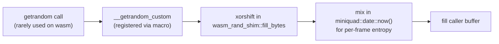

# WebAssembly build

The same Rust binary runs in the browser via `wasm32-unknown-unknown`.
This doc covers the non-obvious parts of getting that to work.

## Build steps

The convenience script is the fast path:

```bash
./scripts/run-web.sh
```

It runs the cargo build, assembles `dist/`, fetches `mq_js_bundle.js`
on first run, and starts `basic-http-server` on `localhost:4000`. The
bundle is cached, so subsequent runs are faster — delete
`dist/mq_js_bundle.js` to force a refresh after bumping macroquad.

If you want to do it by hand (e.g. for debugging or building a
release archive), here's what the script does:

```bash
rustup target add wasm32-unknown-unknown
cargo build --release --target wasm32-unknown-unknown

mkdir -p dist
cp target/wasm32-unknown-unknown/release/clusterlab.wasm dist/
cp web/index.html dist/
# Use the bundle that matches Cargo.lock. This project pins macroquad
# 0.4.14 and miniquad 0.4.8; the bundle on `master` currently matches.
# Some `vX.Y.Z` version tags lack the `js/` folder and return 404 —
# `master` is the reliable URL until a future macroquad release
# breaks the alignment again.
curl -fL -o dist/mq_js_bundle.js \
  https://raw.githubusercontent.com/not-fl3/macroquad/master/js/mq_js_bundle.js

basic-http-server dist/
```

`.github/workflows/wasm.yml` runs the manual steps on CI and deploys to
GitHub Pages.

## The `--allow-undefined` link error (Rust 1.96+)

If you see linker errors like:

```
rust-lld: error: undefined symbol: glGenVertexArrays
rust-lld: error: undefined symbol: now
rust-lld: error: undefined symbol: glActiveTexture
...
```

…you're on Rust 1.96 or newer, which removed the default `--allow-undefined`
linker flag for wasm targets. macroquad/miniquad rely on it: they declare
GL functions and clock helpers as `extern "C"` so the `mq_js_bundle.js`
JS loader can provide them at runtime.

The fix is committed in `.cargo/config.toml` at the repo root:

```toml
[target.wasm32-unknown-unknown]
rustflags = ["-C", "link-arg=--allow-undefined"]
```

This restores the old behavior. The symbols ARE intentionally undefined
and provided by the JS loader, which is exactly what `--allow-undefined`
supports. Don't remove this file unless macroquad/miniquad start using
`#[link(wasm_import_module = "env")]` on their extern blocks — at that
point the workaround becomes unnecessary.

Background: https://blog.rust-lang.org/2026/04/04/changes-to-webassembly-targets-and-handling-undefined-symbols/

## The gl.js version-mismatch trap

If you load the page and see:

```
Version mismatch: gl.js version is: 2, miniquad crate version is: 262144
```

…you've linked the wrong `mq_js_bundle.js`. Two known-bad sources:

1. `https://not-fl3.github.io/miniquad-samples/mq_js_bundle.js` — the
   hosted copy is years old and tracks an ancient miniquad.
2. Any bundle from a `vX.Y.Z` tag whose miniquad version differs from
   the one in your Cargo.lock.

The fix: vendor the bundle that matches `macroquad` / `miniquad` in
`Cargo.lock`. This project currently pins macroquad 0.4.14 + miniquad
0.4.8, and the bundle on `master` matches:

```
https://raw.githubusercontent.com/not-fl3/macroquad/master/js/mq_js_bundle.js
```

Some older `vX.Y.Z` tags (like `v0.4.5`) don't include the `js/`
folder at all and will 404 — use `master` in that case. If a future
macroquad release on `master` ever bumps miniquad ahead of your
Cargo.lock, downgrade by pinning to the matching version tag instead.

After downloading the right bundle, **hard-refresh the browser**
(Cmd+Shift+R / Ctrl+Shift+R). Browsers aggressively cache JS files, so
a soft reload may keep showing the old bundle's error.

## The getrandom compile-error trap

`rand 0.8` pulls in `getrandom 0.2`. On `wasm32-unknown-unknown` without
a backend feature, `getrandom` refuses to compile with:

```
the wasm*-unknown-unknown targets are not supported by default,
you may need to enable the "js" feature
```

The naive fix is to enable `features = ["js"]`. **Don't.** That pulls in
`wasm-bindgen`, which breaks macroquad's simple loader with:

```
TypeError: import object field '__wbindgen_placeholder__' is not an Object
```

The right fix is `getrandom`'s `custom` feature plus a tiny shim. From
`Cargo.toml`:

```toml
[target.'cfg(target_arch = "wasm32")'.dependencies]
getrandom = { version = "0.2", features = ["custom"] }
```

The shim lives at the top of `src/main.rs` and registers a xorshift PRNG
seeded from `miniquad::date::now()`:



We never actually call `getrandom` on the hot path — `StdRng::seed_from_u64`
covers all the algorithm randomness — but the shim satisfies the linker.

## Loader architecture

The mq_js_bundle.js loader works like this:


Three things must line up:

1. `index.html` references `mq_js_bundle.js` (relative path, same origin).
2. `mq_js_bundle.js` is the version matching the miniquad in `Cargo.lock`.
3. `clusterlab.wasm` exports the symbols `mq_js_bundle.js` expects (it
   does, since macroquad's `#[macroquad::main]` macro emits them).

## Rust toolchain version

Native build works with Rust 1.75+. The wasm build needs **Rust 1.77+**
because `wasm-bindgen-shared` (transitively pulled by some dependency
versions) requires it. If you hit:

```
package `wasm-bindgen-shared v0.2.121` cannot be built because it
requires rustc 1.77 or newer
```

…run `rustup update` and try again. If you must stick with an older
toolchain, you can `cargo update -p wasm-bindgen-shared --precise <older-version>`
to pin a compatible release.

## What does NOT work in wasm

- File system access (no `std::fs`). All datasets are embedded with
  `include_str!`.
- `thread_rng()` and other `OsRng` calls (we use seeded `StdRng` only).
- Native threading (`std::thread::spawn`). Macroquad enforces this with
  panics on misuse.
